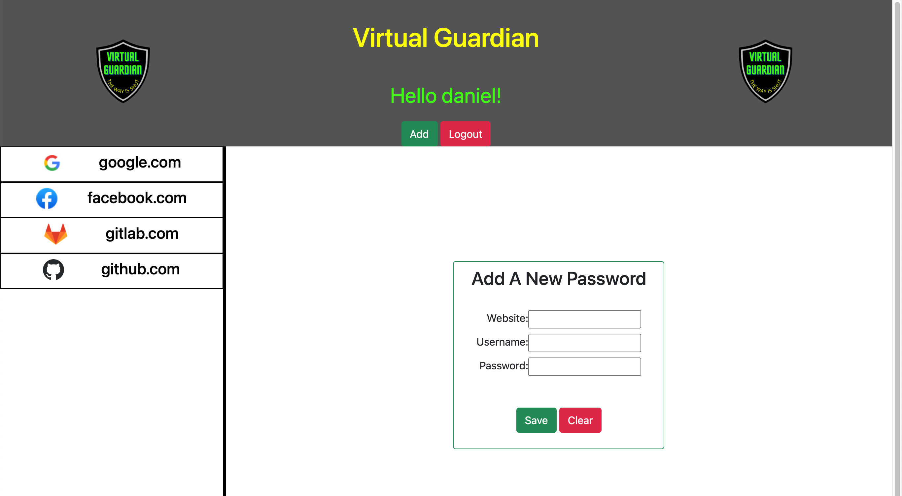

# Virtual Guardian

## About

Online security and safety is more important than ever. When you are home, you lock our door. When you are in your car, you put on our seatbelt. When you are online, you use Virtual Guardian.
 
 
With Virtual Guardian, you can login into your account to create records of all your online usernames and passwords. By having all of their records in one place, users to use unique passwords for all of their online accounts, minimizing the damage of one leaked password. Simply sign-up, add your passwords and relax knowing Virtual Guardian is on your side.
 
 

 
 

## Built with

- Node JS
- Express
- Handlebars
- Sequelize
- Bcrypt
- Crypto JS

## Powered By (API's used)

FaviconGrabber.com

## Website:

- [Deploy](https://password-manager-gadaell.herokuapp.com/)

## GitHub Repo:

- [GitHub](https://github.com/gadaell/Password-Manager)

## Contribution

Made by A'Darius (A'D) Ellis, Daniel Zamanillo, Patrick Abernathy

### ©️2021 Virtual Guardian
